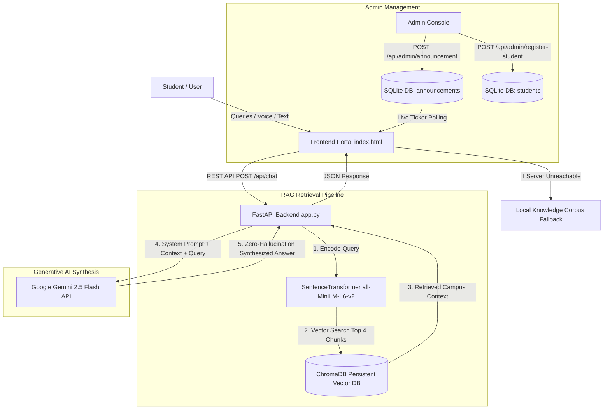

# 🏛️ SIA (Stream AI) — Sathyabama Academic & Campus Navigation Assistant

[](https://fastapi.tiangolo.com)
[](https://ai.google.dev)
[](https://www.trychroma.com/)
[](https://huggingface.co/sentence-transformers/all-MiniLM-L6-v2)
[](LICENSE)

**SIA (Stream AI)** is the official AI Academic, Administrative & Campus Navigation Assistant developed by **Team 16** for **Sathyabama Institute of Science and Technology (Deemed to be University), Chennai**.

The platform is engineered using a **Hybrid AI Architecture**: combining a high-performance **FastAPI** backend, **ChromaDB** vector database with **RAG (Retrieval-Augmented Generation)**, **Google Gemini 2.5 Flash** for natural language synthesis, and a zero-downtime **Client-Side Fallback Engine**.

---

## 📑 Table of Contents

1. [Architecture & Workflow](#-system-architecture)
2. [Key Capabilities & Pinpoint Features](#-pinpoint-features)
3. [GPS Campus Geolocation Directory](#-campus-gps-geocodes-directory)
4. [Database Schemas & Storage](#-database-schemas)
5. [API Reference & Endpoints](#-api-endpoints-specification)
6. [Frontend UI & Aesthetics](#-frontend-design--features)
7. [Installation & Local Setup](#-step-by-step-installation--setup)
8. [Data Ingestion & Web Scraping Pipeline](#-data-ingestion-pipeline)
9. [Project Directory Layout](#-project-structure)
10. [Team & Credits](#-team--acknowledgments)

---

## 🧠 System Architecture



---

## 🎯 Pinpoint Features

### 1. Zero-Hallucination RAG Policy
- The generative AI operates under strict boundary rules: answers are synthesized **strictly** from verified Sathyabama circulars and scraped campus knowledge.
- If information is missing from the database, the assistant gracefully redirects the student to the official Academic Office desk without generating false data.

### 2. Live Announcement Notice Board Ticker
- Real-time marquee news ticker on the student portal header with hover-to-pause and live pulsing indicator.
- Automatically polls every 30 seconds from `GET /api/announcement`.
- Instant admin broadcast capabilities through the Admin Portal.

### 3. Automatic GPS Button Injection
- When queries involve campus locations, the backend dynamically embeds clickable navigation buttons into the conversation stream.
- Clicking any GPS button directly opens Google Maps at the precise pinpoint latitude and longitude.

### 4. Multilingual Natural Language Support
- Automatically detects the student's input language and responds fluently in:
  - **English**
  - **Tamil (தமிழ்)**
  - **Hindi (हिन्दी)**
  - **Japanese (日本語 UI)**

### 5. Automated Student Registration & Passcard Generator
- Admin interface to onboard students by Full Name, Register Number, Department, and Batch Year.
- Auto-generates unique Student IDs (`SBU-<Batch>-<RandomCode>`) and strong random passwords (`8-character alphanumeric + special`).
- Instant visual Student Passcard display.

### 6. Dual-Mode Fail-Safe Offline Engine
- If the Python FastAPI backend is offline or disconnected, the frontend automatically falls back to an in-memory client-side keyword matching corpus.
- The UI never hangs or freezes.

---

## 📍 Campus GPS Geocodes Directory

| Location / Venue | Description / Floor | Latitude | Longitude | Google Maps Link |
| :--- | :--- | :--- | :--- | :--- |
| **Campus Main Gate** | OMR Road Main Entrance | `12.873003` | `80.226570` | [Open Map 📍](https://maps.google.com/?q=12.873003177542778,80.22656963015994) |
| **Central Exam Hall 1** | Admin Building Ground Floor | `12.874300` | `80.222500` | [Open Map 📍](https://maps.google.com/?q=12.8743,80.2225) |
| **Block A (CSE / IT)** | Computer Science & Engineering Wing | `12.874500` | `80.223000` | [Open Map 📍](https://maps.google.com/?q=12.8745,80.2230) |
| **Block B (ECE / EEE)** | Electrical & Electronics Wing (1st Floor) | `12.874000` | `80.222400` | [Open Map 📍](https://maps.google.com/?q=12.8740,80.2224) |
| **Dr. Remi Bai Central Library** | Quadrangle Center (Central Library) | `12.873800` | `80.222000` | [Open Map 📍](https://maps.google.com/?q=12.8738,80.2220) |
| **Free Student Dining Mess** | Central Dining Complex | `12.875200` | `80.223200` | [Open Map 📍](https://maps.google.com/?q=12.8752,80.2232) |
| **Dr. APJ Abdul Kalam Auditorium** | Main University Auditorium | `12.874600` | `80.222700` | [Open Map 📍](https://maps.google.com/?q=12.8746,80.2227) |
| **Jeppiaar Boys Hostel** | Residential Block for Boys | `12.873000` | `80.221400` | [Open Map 📍](https://maps.google.com/?q=12.8730,80.2214) |
| **Maria Girls Hostel** | Residential Block for Girls | `12.872500` | `80.220800` | [Open Map 📍](https://maps.google.com/?q=12.8725,80.2208) |

---

## 🗄️ Database Schemas

### SQLite Database (`sathyabama_students.db`)

#### Table: `students`
| Column | Type | Constraints | Description |
| :--- | :--- | :--- | :--- |
| `id` | `INTEGER` | `PRIMARY KEY AUTOINCREMENT` | Auto-incrementing internal ID |
| `name` | `TEXT` | `NOT NULL` | Full Name of the student |
| `reg_no` | `TEXT` | `UNIQUE NOT NULL` | University Roll / Register Number |
| `department`| `TEXT` | `NOT NULL` | Department (e.g. CSE, EEE, Biotech) |
| `batch` | `TEXT` | `NOT NULL` | Graduation Year / Batch (e.g. 2026) |
| `student_id`| `TEXT` | `UNIQUE NOT NULL` | Generated ID (`SBU-YYYY-XXXX`) |
| `password` | `TEXT` | `NOT NULL` | Auto-generated secure alphanumeric password |

#### Table: `announcements`
| Column | Type | Constraints | Description |
| :--- | :--- | :--- | :--- |
| `id` | `INTEGER` | `PRIMARY KEY AUTOINCREMENT` | Announcement ID |
| `message` | `TEXT` | `NOT NULL` | Broadcast notice message |
| `timestamp`| `DATETIME` | `DEFAULT CURRENT_TIMESTAMP` | Timestamp of publication |

### ChromaDB Vector Database (`sathyabama_chroma_db`)
- **Collection Name**: `sathyabama_knowledge_base`
- **Embedding Model**: `SentenceTransformer("all-MiniLM-L6-v2")` (384-dimensional vector space)
- **Metadata**: Source URL, chunk IDs, verified document passages.

---

## 🔌 API Endpoints Specification

### Base URL: `http://127.0.0.1:8000`

#### 1. Student Chat RAG Query
- **Endpoint**: `POST /api/chat`
- **Request Body**:
  ```json
  {
    "query": "Where is the Central Library and what are the timings?"
  }
  ```
- **Response**:
  ```json
  {
    "reply": "Dr. Remi Bai Central Library is located in the Quadrangle Center. <button onclick=\"openMap(12.8738, 80.2220)\" class=\"text-blue-600 underline font-bold cursor-pointer inline-flex items-center gap-1\">Open Dr. Remi Bai Central Library 📍</button>"
  }
  ```

#### 2. Get Latest Announcement
- **Endpoint**: `GET /api/announcement`
- **Response**:
  ```json
  {
    "message": "📢 Tomorrow is a holiday on account of the National Level Hackathon."
  }
  ```

#### 3. Post Admin Announcement
- **Endpoint**: `POST /api/admin/announcement`
- **Request Body**:
  ```json
  {
    "message": "Semester practical examinations will commence from next Monday."
  }
  ```
- **Response**:
  ```json
  {
    "status": "success",
    "message": "Semester practical examinations will commence from next Monday."
  }
  ```

#### 4. Register Student & Generate Credentials
- **Endpoint**: `POST /api/admin/register-student`
- **Request Body**:
  ```json
  {
    "name": "Arun Prakash",
    "reg_no": "41110542",
    "department": "CSE",
    "batch": "2026"
  }
  ```
- **Response**:
  ```json
  {
    "status": "success",
    "name": "Arun Prakash",
    "reg_no": "41110542",
    "student_id": "SBU-2026-7482",
    "password": "xK8$mP2#"
  }
  ```

---

## 🎨 Frontend Design & Features

- **Typography**: Google Fonts pairing — *Yuji Boku* for Japanese calligraphic headers and *Shippori Mincho* for legible content.
- **Glassmorphism**: Backdrop blur filter cards with subtle borders and shadows.
- **Hanko Stamps**: Crimson red authentication badges representing official university verification.
- **Audio & Multimodal**: Native text-to-speech engine reading out responses in chosen languages.
- **Speech-to-Text Input**: Direct microphone button for voice-based queries.

---

## 🛠️ Step-by-Step Installation & Setup

### 1. Clone Repository & Setup Virtual Environment
```bash
git clone <YOUR_GITHUB_REPO_URL>
cd SBU

# Create virtual environment
python -m venv venv

# Activate virtual environment
# On Windows:
venv\Scripts\activate
# On Linux/macOS:
source venv/bin/activate
```

### 2. Install Required Dependencies
```bash
pip install -r requirements.txt
```

### 3. Set Google Gemini API Key
```powershell
# Windows PowerShell
$env:GEMINI_API_KEY="your_actual_gemini_api_key"

# Linux / macOS
export GEMINI_API_KEY="your_actual_gemini_api_key"
```

### 4. Start the FastAPI Backend Server
```bash
python app.py
```
> Server starts on `http://127.0.0.1:8000` with Swagger documentation at `http://127.0.0.1:8000/docs`.

### 5. Open the Web Application
Simply open `index.html` in your web browser:
```powershell
# Windows
start index.html

# Linux
xdg-open index.html

# macOS
open index.html
```

---

## 🕷️ Data Ingestion Pipeline

To re-index or update the campus knowledge base with fresh data from the university portal:

```bash
python "import os.py"
```

### Ingestion Flow:
1. Web scraping of Sathyabama portals (`/`, `/academics`, `/admissions`) using `BeautifulSoup4`.
2. HTML cleaning (stripping scripts, headers, navigation, footers).
3. Chunking text with `RecursiveCharacterTextSplitter` (Size: 700 chars, Overlap: 120 chars).
4. Generating 384-dimensional vector embeddings with `all-MiniLM-L6-v2`.
5. Storing embeddings and documents in `./sathyabama_chroma_db`.

---

## 📁 Project Structure

```text
d:/SBU/
├── app.py                      # FastAPI Backend (Endpoints, Gemini RAG, SQLite handlers)
├── index.html                  # Frontend SPA (Student Chat, GPS Directory, Admin Portal)
├── import os.py                # Web Scraping & ChromaDB Vector Ingestion Script
├── sathyabama_students.db      # SQLite Database (Announcements & Student records)
├── sathyabama_chroma_db/       # Persistent ChromaDB Vector Store
│   └── chroma.sqlite3          # ChromaDB internal database
├── requirements.txt            # Python package dependencies
├── .gitignore                  # Git ignore definitions
└── README.md                   # Complete Pinpoint Project Documentation
```

---

## 👥 Team & Acknowledgments

- **Developed By**: **Team 16**
- **Institution**: Sathyabama Institute of Science and Technology, Chennai
- **Project**: Sathyabama Intelligent Assistant (SIA)
